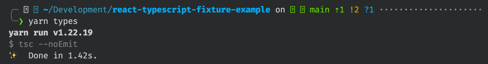

<div align="center">
    <h1>
        <span aria-hidden="true">🧪<br/></span>
        React Typescript Fixtures Example
    </h1>
</div>

## ⁉️ What is this?

Hey friends! Welcome to `react-typescript-fixture-example`, a repository designed as a follow along exercise for [this video](https://www.youtube.com/watch?v=egTdM6Jzk4Q).

<!-- Add link to video when it's done -->

## 🧱 Setup

```bash
# Install dependencies
yarn install

# Start the react development server
yarn start

# Start the local storybook server
yarn storybook
```

## 🏋️ The exercise

If you'd like to try this out for yourself, here are the steps we took during the video.

### 🔢 Add a new property

Jump into [`product.types.ts`](./src/product/product.types.ts) and add a new property to the `Product` interface. I added `quantity` like so:

```ts
// ./src/product/product.types.ts
export interface Product {
  sku: string;
  name: string;
  description: string;
}
```

### 🔍 Check your types

Now try running `yarn types` in your terminal. Get a load of all those errors 🤯


### 👷 Build a factory

Let's create a new file for our mock Product factory! I put it in a new file called `./src/products/testing/product.fixtures.ts`

First let's create a constant that will hold all of the default properties of our mock product, like so.

```ts
// ./src/products/testing/product.fixtures.ts

import { Product } from "../product.types";

const DEFAULT_MOCK_PRODUCT: Product = {
  sku: "xxxxxx",
  name: "cube",
  description: "like a square but 3d!",
  quantity: 100,
};
```

Now that we have our defaults set up. Let's create our mocking function.
This function should accept an argument of type `Partial<Product>`. What ever is passed in here will act as our mock product overrides.

```ts
// ./src/products/testing/product.fixtures.ts

import { Product } from "../product.types";

const DEFAULT_MOCK_PRODUCT: Product = {
  sku: "xxxxxx",
  name: "cube",
  description: "like a square but 3d!",
  quantity: 100,
};

export const createMockProduct = (overrides: Partial<Product>): Product => ({
  ...DEFAULT_MOCK_PRODUCT,
  ...overrides,
});
```

Anything added to the `overrides` argument will replace the properties from `DEFAULT_MOCK_PRODUCT`.

### ✨ Use your factory

Now let's use our new mocking function in our stories! here's an example from the `./src/stories/product-details.stories.tsx`

```diff
export const Default = Template.bind({});
Default.args = {
-  product: {
-    name: "D4",
-    sku: "xxxxx",
-    description: "A four sided die!",
-  },
+  product: createMockProduct({
+    name: "D4",
+    description: "A four sided die!",
+  }),
};
```

Once you've updated all your stories. Try running `yarn types` again.


